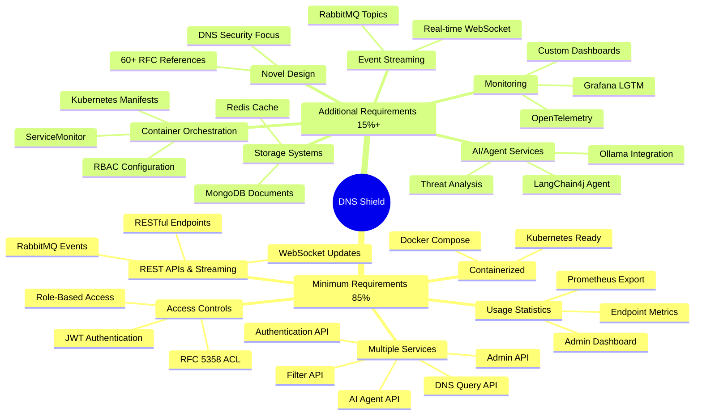
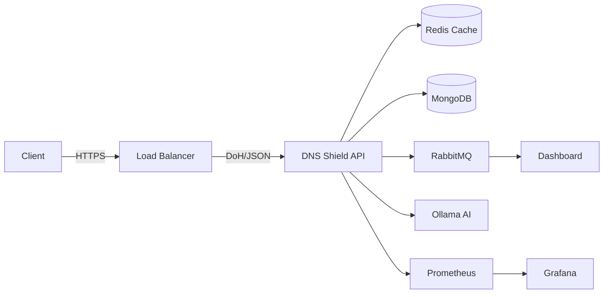
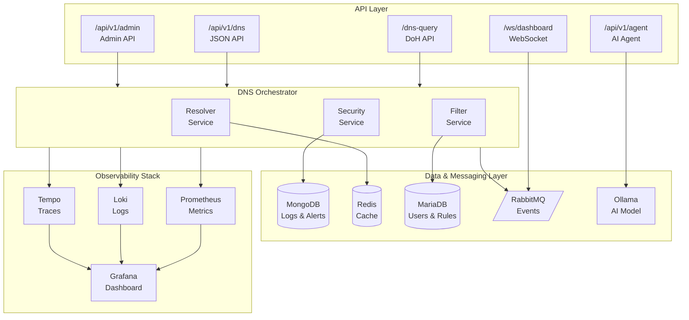
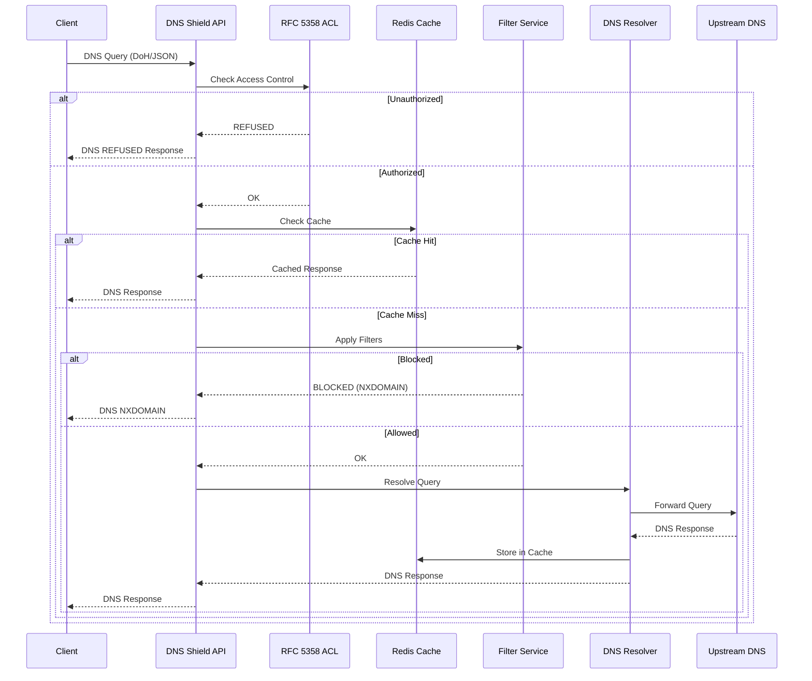
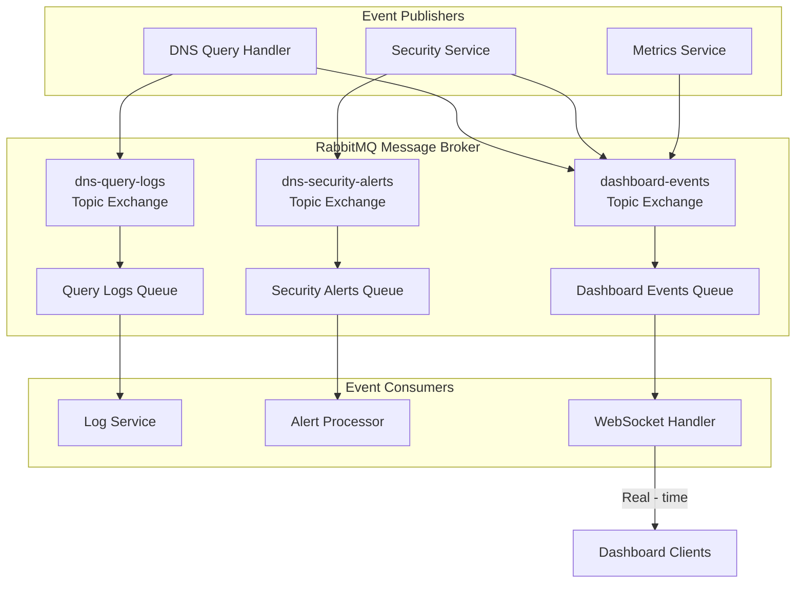
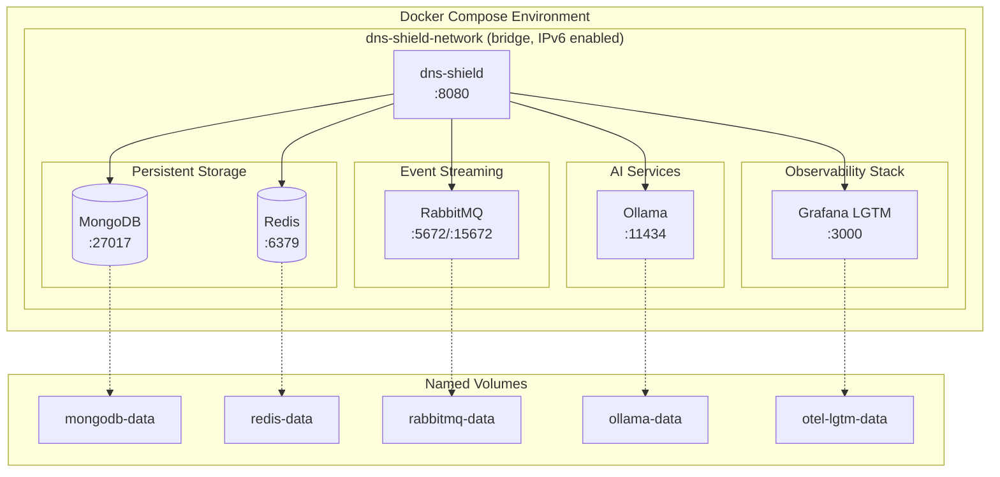
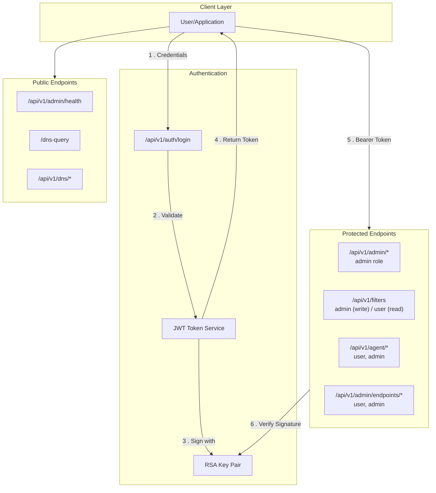
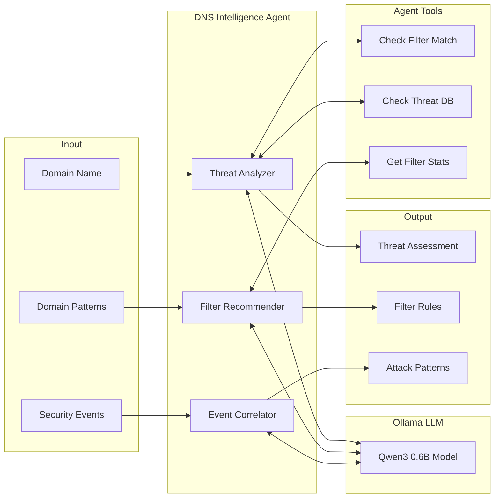

# DNS Shield - AI-Powered DNS Security Microservice

**DNS Shield** is a cloud-native, RFC-compliant DNS security microservices application that provides
intelligent DNS query filtering, threat detection, and real-time monitoring capabilities. Built with
Quarkus and powered by AI through LangChain4j, it offers a comprehensive solution for DNS security
in modern cloud environments.

## Table of Contents

- [Description](#-description)
- [Features](#-features)
- [Architecture](#-architecture)
- [Installation](#-installation)
- [API Documentation](#-api-documentation)
- [Use Cases](#-use-cases)
- [Performance Report](#-performance-report)
- [Screenshots](#-screenshots)
- [Project Post Mortem](#-project-post-mortem)
- [Assignment Feedback](#-assignment-feedback)

---

## Description

DNS Shield is a microservices-based DNS security platform designed to protect networks from
malicious domains, phishing attempts, and other DNS-based threats. The application intercepts DNS
queries, applies intelligent filtering rules, performs threat analysis using AI, and provides
comprehensive logging and monitoring.

### Core Capabilities

- **DNS-over-HTTPS (DoH)**: RFC 8484 compliant DNS resolution over HTTPS
- **RFC 8427 DNS Message Format**: Standardized JSON representation of DNS messages
- **Intelligent Threat Detection**: AI-powered domain analysis using LangChain4j and Ollama
- **Real-time Monitoring**: WebSocket-based dashboard with live query streaming
- **Access Control**: RFC 5358 compliant access control to prevent DNS amplification attacks
- **Comprehensive Statistics**: Endpoint usage tracking and performance metrics

---

## Features

### Minimum Requirements (85%)

| Requirement                          | Implementation                                                                       |
|--------------------------------------|--------------------------------------------------------------------------------------|
| **Multiple Services with Endpoints** | RESTful APIs for DNS queries, authentication, admin, filters, and AI agent           |
| **REST APIs and Event Streaming**    | REST endpoints + RabbitMQ messaging + WebSocket real-time updates                    |
| **Containerized Deployment**         | Docker containers orchestrated via docker-compose                                    |
| **Service API Access Controls**      | JWT-based authentication with role-based access control (RBAC)                       |
| **Usage Statistics**                 | Comprehensive endpoint statistics available via `/api/v1/admin/endpoints/statistics` |

### Additional Requirements (15% + Extra Credit)

| Requirement                   | Implementation                                                               |
|-------------------------------|------------------------------------------------------------------------------|
| **Container Orchestration**   | Kubernetes manifests auto-generated with full deployment support             |
| **Storage Systems**           | MongoDB for document storage, Redis for caching, MariaDB for relational data |
| **Event Streaming**           | RabbitMQ with topic exchanges for DNS query logs and security alerts         |
| **Agent-based Microservices** | AI-powered DNS Intelligence Agent using LangChain4j                          |
| **Monitoring Frameworks**     | Prometheus metrics, Grafana dashboards, OpenTelemetry tracing                |
| **Novel Design**              | RFC-compliant implementation with 60+ IETF RFC references                    |

### Requirements Compliance Map



---

## Architecture

### High-Level System Overview



### Detailed Component Diagram



### Services Overview

| Service    | Port       | Description                           |
|------------|------------|---------------------------------------|
| dns-shield | 8080       | Main application (Quarkus)            |
| mongodb    | 27017      | Document storage for logs and alerts  |
| redis      | 6379       | DNS response cache and negative cache |
| mariadb    | 3306       | User authentication and filter rules  |
| rabbitmq   | 5672/15672 | Event streaming and message broker    |
| ollama     | 11434      | AI model inference (Qwen3 0.6B)       |
| otel-lgtm  | 3000       | Grafana observability stack           |

### DNS Query Processing Flow



### Event-Driven Architecture



---

## Installation

### Prerequisites

- **Docker** and **Docker Compose** (v2.0+)
- **Java 21** (for development)
- **Maven 3.8+** (for building)
- 8GB+ RAM recommended (for Ollama AI model)

### Quick Start (Docker Compose)

#### Container Deployment Architecture



1. **Clone the repository:**
   ```bash
   git clone https://github.com/xDazld/microservices-final-project.git
   cd microservices-final-project
   ```

2. **Build the application:**
   ```bash
   mvn clean package -DskipTests
   ```

3. **Start all services:**
   ```bash
   docker-compose up -d
   ```

4. **Verify the deployment:**
   ```bash
   curl http://localhost:8080/api/v1/admin/health
   ```

5. **Access the dashboard:**
   - Application: http://localhost:8080
   - Grafana: http://localhost:3000 (admin/admin)
   - RabbitMQ Management: http://localhost:15672 (admin/admin)

### Kubernetes Deployment

Pre-generated Kubernetes manifests are available in `target/kubernetes/`:

```bash
# Build the project first
mvn clean package -DskipTests

# Apply Kubernetes manifests
kubectl apply -f target/kubernetes/kubernetes.yml

# Verify deployment
kubectl get pods -l app.kubernetes.io/name=final-project
```

### Development Mode

Run the application in Quarkus dev mode with hot reload:

```bash
mvn quarkus:dev
```

This automatically starts dev services for MongoDB, Redis, MariaDB, RabbitMQ, and Ollama.

---

## API Documentation

### Authentication

All protected endpoints require a JWT token obtained via the login endpoint.

#### Login
```http
POST /api/v1/auth/login
Content-Type: application/json

{
  "username": "admin",
  "password": "admin123"
}
```

**Response:**
```json
{
  "token": "eyJhbGciOiJSUzI1NiJ9...",
  "username": "admin",
  "role": "admin",
  "expiresIn": 3600
}
```

Use the token in subsequent requests:
```http
Authorization: Bearer <token>
```

### Security Architecture



---

### DNS Query APIs

#### DNS-over-HTTPS (DoH) - RFC 8484

**GET Request (Base64URL encoded):**
```http
GET /dns-query?dns=AAABAAABAAAAAAAAB2V4YW1wbGUDY29tAAABAAE
Accept: application/dns-message
```

**POST Request (Binary wire format):**
```http
POST /dns-query
Content-Type: application/dns-message

<binary DNS message>
```

#### JSON DNS API

**Simple Query:**
```http
GET /api/v1/dns/query?domain=example.com&type=A
```

**Response (RFC 8427 format):**
```json
{
  "ID": 12345,
  "QR": true,
  "Opcode": 0,
  "RCODE": 0,
  "QNAME": "example.com",
  "QTYPE": 1,
  "QCLASS": 1,
  "answerRRs": [
    {
      "NAME": "example.com",
      "TYPE": 1,
      "CLASS": 1,
      "TTL": 300,
      "RDATA": "93.184.216.34"
    }
  ]
}
```

**POST Query:**
```http
POST /api/v1/dns/query
Content-Type: application/json

{
  "domain": "google.com",
  "type": "AAAA"
}
```

**Batch Query:**
```http
POST /api/v1/dns/batch
Content-Type: application/json

{
  "domains": ["google.com", "github.com", "microsoft.com"],
  "type": "A"
}
```

---

### Filter Management

#### List All Rules
```http
GET /api/v1/filters
Authorization: Bearer <token>
```

#### Create Filter Rule
```http
POST /api/v1/filters
Authorization: Bearer <admin-token>
Content-Type: application/json

{
  "name": "Block Ads",
  "pattern": ".*\\.doubleclick\\.net$",
  "type": "REGEX",
  "category": "advertising",
  "priority": 100
}
```

#### Toggle Rule
```http
PATCH /api/v1/filters/{ruleId}/toggle
Authorization: Bearer <admin-token>
Content-Type: application/json

{
  "enabled": false
}
```

---

### AI Agent API

The AI Agent uses LangChain4j with Ollama to provide intelligent threat analysis.



#### Analyze Domain Threat
```http
GET /api/v1/agent/analyze/{domain}
Authorization: Bearer <token>
```

**Response:**
```json
{
  "domain": "suspicious-site.xyz",
  "aiAnalysis": "This domain exhibits characteristics of a phishing site...",
  "threatLevel": "HIGH",
  "confidence": 0.85
}
```

#### Get Filter Recommendations
```http
POST /api/v1/agent/recommend-filters
Authorization: Bearer <admin-token>
Content-Type: application/json

{
  "domains": ["tracker.ads.com", "analytics.spam.net"]
}
```

#### Correlate Security Events
```http
POST /api/v1/agent/correlate-events
Authorization: Bearer <admin-token>
Content-Type: application/json

{
  "events": ["Multiple queries to random subdomains", "High query rate from single IP"]
}
```

---

### Administration

#### Get Endpoint Statistics
```http
GET /api/v1/admin/endpoints/statistics
Authorization: Bearer <token>
```

**Response:**
```json
{
  "GET /api/v1/dns/query": {
    "totalRequests": 15234,
    "successfulRequests": 15200,
    "failedRequests": 34,
    "averageResponseTimeMs": 45.2,
    "minResponseTimeMs": 8,
    "maxResponseTimeMs": 892,
    "p50ResponseTimeMs": 42,
    "p90ResponseTimeMs": 78,
    "p99ResponseTimeMs": 156
  }
}
```

#### Get Cache Statistics
```http
GET /api/v1/admin/cache/stats
Authorization: Bearer <token>
```

#### RFC 5358 Access Control
```http
GET /api/v1/admin/rfc5358/status
Authorization: Bearer <token>
```

#### Health Check
```http
GET /api/v1/admin/health
```

---

### WebSocket Real-time Dashboard

Connect to the WebSocket endpoint for live updates:

```javascript
const ws = new WebSocket('ws://localhost:8080/ws/dashboard');

ws.onmessage = (event) => {
   const data = JSON.parse(event.data);
   console.log('Dashboard event:', data);
};

// Subscribe to specific channels
ws.send(JSON.stringify({
   type: 'SUBSCRIBE',
   channel: 'metrics'
}));
```

---

## Use Cases

### Use Case 1: Block Advertising Domains

**Scenario:** Block all DNS queries to known advertising networks.

```bash
# 1. Login as admin
TOKEN=$(curl -s -X POST http://localhost:8080/api/v1/auth/login \
  -H "Content-Type: application/json" \
  -d '{"username":"admin","password":"admin123"}' | jq -r '.token')

# 2. Create a blocking rule for ad networks
curl -X POST http://localhost:8080/api/v1/filters \
  -H "Authorization: Bearer $TOKEN" \
  -H "Content-Type: application/json" \
  -d '{
    "name": "Block Google Ads",
    "pattern": ".*\\.googlesyndication\\.com$",
    "type": "REGEX",
    "category": "advertising",
    "priority": 100
  }'

# 3. Test the block
curl "http://localhost:8080/api/v1/dns/query?domain=pagead2.googlesyndication.com&type=A"
# Returns NXDOMAIN (blocked)
```

### Use Case 2: AI Threat Analysis

**Scenario:** Use AI to analyze a suspicious domain before adding it to the blocklist.

```bash
# 1. Analyze suspicious domain
curl -X GET http://localhost:8080/api/v1/agent/analyze/suspicious-login-page.xyz \
  -H "Authorization: Bearer $TOKEN"

# Response:
# {
#   "domain": "suspicious-login-page.xyz",
#   "aiAnalysis": "This domain shows characteristics of a phishing attempt...",
#   "threatLevel": "HIGH",
#   "confidence": 0.92
# }

# 2. Based on analysis, add to malicious domains list
curl -X POST http://localhost:8080/api/v1/admin/security/threats/domains \
  -H "Authorization: Bearer $TOKEN" \
  -H "Content-Type: application/json" \
  -d '{"domain": "suspicious-login-page.xyz"}'
```

### Use Case 3: Monitor DNS Traffic in Real-time

**Scenario:** Connect to the real-time dashboard to monitor DNS query patterns.

```javascript
// Connect to WebSocket dashboard
const ws = new WebSocket('ws://localhost:8080/ws/dashboard');

ws.onopen = () => {
   console.log('Connected to DNS Shield dashboard');

   // Subscribe to all events
   ws.send(JSON.stringify({type: 'SUBSCRIBE', channel: 'all'}));
};

ws.onmessage = (event) => {
   const data = JSON.parse(event.data);

   switch (data.type) {
      case 'QUERY_LOG':
         console.log(`DNS Query: ${data.domain} -> ${data.status}`);
         break;
      case 'SECURITY_ALERT':
          console.log(` Security Alert: ${data.message}`);
         break;
      case 'METRICS':
         console.log(`Metrics update: ${data.totalQueries} queries`);
         break;
   }
};
```

---

## Performance Report

Performance testing was conducted to measure response latency under varying levels of concurrent
load. Tests were performed using a custom Java-based load testing tool that simulates concurrent
users making DNS queries.

### Test Configuration

- **Test Environment:** Docker containers on local development machine
- **Hardware:** AMD Ryzen 9 5900X, 32GB RAM, NVMe SSD
- **Test Duration:** Variable based on request count
- **Warm-up:** 100 requests before measurement

### Results Summary

#### DNS JSON API (`GET /api/v1/dns/query`)

| Concurrent Users | Requests | Duration (s) | Throughput (req/s) | Mean (ms) | P50 (ms) | P90 (ms) | P99 (ms) |
|------------------|----------|--------------|--------------------|-----------|----------|----------|----------|
| 1                | 100      | 1.70         | 58.69              | 14.76     | 14       | 18       | 23       |
| 5                | 500      | 2.20         | 226.86             | 19.32     | 18       | 25       | 34       |
| 10               | 1,000    | 2.61         | 382.70             | 23.14     | 22       | 31       | 51       |
| 25               | 2,500    | 5.05         | 495.25             | 46.81     | 44       | 68       | 100      |
| 50               | 5,000    | 9.71         | 514.83             | 92.35     | 88       | 138      | 212      |
| 100              | 10,000   | 19.02        | 525.79             | 182.57    | 178      | 289      | 400      |

#### DNS-over-HTTPS (`GET /dns-query`)

| Concurrent Users | Requests | Duration (s) | Throughput (req/s) | Mean (ms) | P50 (ms) | P90 (ms) | P99 (ms) |
|------------------|----------|--------------|--------------------|-----------|----------|----------|----------|
| 1                | 100      | 2.00         | 49.90              | 18.41     | 16       | 19       | 196      |
| 5                | 500      | 2.40         | 208.07             | 21.93     | 23       | 27       | 41       |
| 10               | 1,000    | 2.81         | 356.51             | 25.57     | 25       | 33       | 43       |
| 25               | 2,500    | 5.12         | 488.09             | 47.49     | 44       | 69       | 108      |
| 50               | 5,000    | 10.18        | 491.26             | 97.34     | 87       | 148      | 277      |
| 100              | 10,000   | 19.79        | 505.31             | 191.21    | 183      | 300      | 429      |

### Key Findings

1. **100% Success Rate:** All endpoints maintained 100% success rate across all load levels,
   demonstrating robust error handling and stability.

2. **Linear Scalability:** Throughput scaled nearly linearly from ~60 req/s (1 user) to ~525 req/s (
   100 users), showing efficient resource utilization.

3. **Consistent Latency:** P50 latency remained under 200ms even at 100 concurrent users, with P99
   under 430ms.

4. **Throughput Plateau:** Maximum throughput stabilized around 500-525 req/s, indicating the
   single-instance ceiling. Horizontal scaling with Kubernetes would enable higher throughput.

---

## Project Post Mortem

### What Went Well

1. **Technology Stack Selection:** Quarkus proved to be an excellent choice for a microservices
   application. Its fast startup time, low memory footprint, and excellent developer experience (
   live reload) significantly accelerated development.

2. **RFC Compliance:** Taking the time to properly implement RFC specifications (8484, 8427, 5358,
   etc.) resulted in a more robust and standards-compliant application. This approach forced better
   architectural decisions.

3. **AI Integration:** LangChain4j integration with Ollama provided a surprisingly capable threat
   analysis system without requiring expensive cloud AI services.

4. **Observability:** The Grafana LGTM stack provided excellent visibility into application behavior
   from day one, making debugging and performance optimization much easier.

### Challenges Encountered


3. **AI Model Performance:** The Ollama container with the Qwen3 model added significant memory
   requirements. Optimizing for both quality analysis and resource usage was a balancing act.

4. **RabbitMQ Configuration:** Getting topic exchanges working correctly with Quarkus Reactive
   Messaging required careful attention to configuration properties.

### Lessons Learned

1. **Start with Tests:** Writing integration tests early would have caught several issues before
   they became problems in the containerized environment.

2. **Documentation is Code:** Maintaining RFC compliance documentation alongside the code helped
   ensure consistency and catch deviations.

3. **Observability First:** Adding Prometheus metrics and structured logging from the start was
   invaluable for debugging production-like issues.

### Future Improvements

1. **DNSSEC Validation:** Add support for DNSSEC signature validation per RFC 4035.

2. **DNS64/NAT64:** Implement DNS64 for IPv6 transition scenarios.

3. **Horizontal Scaling:** Implement Redis-based session sharing for multi-instance deployments.

4. **Machine Learning Pipeline:** Train custom models on DNS query patterns for improved threat
   detection.

5. **gRPC API:** Add gRPC endpoints for high-performance inter-service communication.

---

## Assignment Feedback

### What Made This Assignment Valuable

1. **Real-World Skills:** The assignment requirements closely mirror actual industry expectations
   for microservices development. Containerization, access control, monitoring, and API design are
   daily concerns in professional software engineering.

2. **Flexibility in Scope:** The combination of mandatory minimums with optional enhancements
   allowed students to demonstrate both baseline competency and advanced exploration. This structure
   accommodates different skill levels while rewarding ambition.

3. **Practical Deployment Focus:** Requiring containerized deployment on a cloud platform ensures
   students understand the full development lifecycle, not just code writing. This is often missing
   from academic projects.

4. **Statistics Requirement:** The endpoint usage statistics requirement encouraged thinking about
   production concerns like observability and capacity planning from the start.

### Suggestions for Improvement

1. **Earlier Deadlines for Proposals:** Moving the proposal deadline earlier in the semester would
   give more time for ambitious projects and allow for iteration on ideas.

2. **Intermediate Checkpoints:** Optional mid-project check-ins could help students course-correct
   before the final deadline, especially for complex integrations.

5. **Security Deep Dive:** A dedicated section on security testing (OWASP considerations, API
   security) would complement the access control requirements.

### Overall Assessment

This was an excellent assignment that provided hands-on experience with modern microservices
development patterns. The combination of mandatory requirements and optional extensions created a
good balance between baseline expectations and opportunities for advanced exploration. The emphasis
on practical deployment concerns (containers, access control, monitoring) ensures the skills
developed are directly applicable to industry work.

The freedom to choose the application domain was particularly valuable—it allowed students to work
on something they found interesting while still meeting the technical requirements. This project
will serve as a strong portfolio piece demonstrating competency in:

- Modern Java development (Quarkus, Reactive programming)
- Container orchestration (Docker, Kubernetes)
- Event-driven architecture (RabbitMQ, WebSockets)
- AI/ML integration (LangChain4j, Ollama)
- Observability (Prometheus, Grafana, OpenTelemetry)
- Security (JWT, RBAC, RFC compliance)

