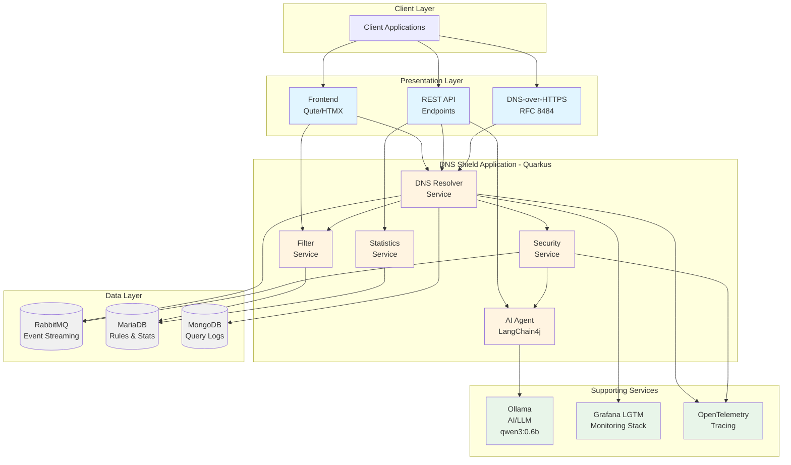

# DNS Shield - AI-Powered DNS Security & Filtering Microservice

## Table of Contents

- [Description](#description)
- [Architecture](#architecture)
- [Features](#features)
- [Installation](#installation)
- [API Documentation](#api-documentation)
- [Usage Examples](#usage-examples)
- [Application Snapshots](#application-snapshots)
- [Performance Report](#performance-report)
- [Project Post Mortem](#project-post-mortem)
- [Assignment Feedback](#assignment-feedback)

---

## Description

**DNS Shield** is an enterprise-grade, cloud-native DNS security and filtering microservice built
with Quarkus. It provides DNS-over-HTTP (DoH) capabilities compliant with RFC 8484, advanced threat
detection using AI agents powered by LangChain4j, and comprehensive DNS filtering with real-time
monitoring and analytics.

The application implements a modern microservices architecture with:

- **Multiple containerized services** orchestrated via Docker Compose
- **Event-driven architecture** using RabbitMQ for asynchronous messaging
- **JWT-based authentication** with role-based access control (RBAC)
- **Real-time monitoring** with OpenTelemetry, Prometheus metrics, and Grafana dashboards
- **AI-powered threat analysis** using autonomous agents (LangChain4j + Ollama)
- **RFC compliance** with multiple DNS RFCs (5358, 8484, 8767, 9520)
- **Multi-database architecture** (MariaDB for relational data, MongoDB for logs)

### Key Use Cases

- DNS query filtering and blocking (ads, tracking, malware)
- DNS-over-HTTP (DoH) resolution
- Real-time threat detection and analysis using AI
- DNS query logging and analytics
- Access control and rate limiting
- Negative caching and stale data serving for improved reliability

---

## Architecture

### System Components



### Technology Stack

**Core Framework:**

- Quarkus 3.30.1 (Java 21)
- Reactive programming with Mutiny

**Databases:**

- MariaDB 10.11 (filter rules, statistics, user data)
- MongoDB 7.0 (query logs, security events)

**Messaging:**

- RabbitMQ 3.12 with topic exchanges
- SmallRye Reactive Messaging

**AI/ML:**

- LangChain4j for agent orchestration
- Ollama (qwen3:0.6b model) for threat analysis

**Security:**

- SmallRye JWT for authentication
- RSA key-pair signing
- Role-based access control (RBAC)

**Observability:**

- OpenTelemetry for distributed tracing
- Micrometer with Prometheus metrics
- Grafana LGTM stack (Loki, Grafana, Tempo, Mimir)

**Containerization:**

- Docker & Docker Compose
- Kubernetes-ready manifests

---

## Features

### ✅ Minimum Requirements Met

- ✅ **Multiple REST endpoints** with various services (DNS, Admin, Auth, Filters, Agent)
- ✅ **Event streaming** via RabbitMQ for real-time updates
- ✅ **Containerized deployment** using Docker Compose
- ✅ **JWT-based access controls** with role-based permissions
- ✅ **Endpoint usage statistics** tracked and exposed via admin API

### 🌟 Additional Features (Extra Credit)

- ✅ **Container orchestration** with Docker Compose and Kubernetes manifests
- ✅ **Multi-database storage** (MariaDB + MongoDB)
- ✅ **Event streaming** architecture with RabbitMQ topic exchanges
- ✅ **AI Agent-based microservices** using LangChain4j
- ✅ **Comprehensive monitoring** with OpenTelemetry and Grafana
- ✅ **RFC compliance** testing (5358, 8484, 8767, 9520)
- ✅ **Real-time web dashboard** with HTMX and Server-Sent Events
- ✅ **Cybersecurity features**: threat detection, filtering, access control

---

## Installation

### Prerequisites

- Docker & Docker Compose (v2.0+)
- 8GB+ RAM recommended (for Ollama AI model)
- Ports available: 8080 (app), 3000 (Grafana)

### Quick Start

1. **Clone the repository:**

```bash
git clone <repository-url>
cd final-project
```

2. **Configure environment variables:**

```bash
cp .env.example .env
# Edit .env if you want to change default credentials
```

3. **Build and start all services:**

```bash
docker-compose up --build
```

This will:

- Build the DNS Shield application
- Start MariaDB, MongoDB, RabbitMQ
- Pull and start Ollama with qwen3:0.6b model (~400MB)
- Start Grafana LGTM monitoring stack
- Initialize databases with schema

4. **Wait for services to be ready** (first start takes 2-3 minutes):

```bash
# Watch logs for "Installed features" from dns-shield-app
docker-compose logs -f dns-shield
```

5. **Access the application:**

- Web UI: http://localhost:8080/ui
- API Docs: http://localhost:8080/q/swagger-ui
- Grafana: http://localhost:3000 (admin/admin)
- Metrics: http://localhost:8080/metrics

### Manual Build (for development)

If you prefer to build without Docker:

```bash
# Build the application
./mvnw clean package

# Run in dev mode with live reload
./mvnw quarkus:dev
```

---

## API Documentation

### Authentication

All protected endpoints require a JWT token in the `Authorization` header:

```
Authorization: Bearer <your-jwt-token>
```

#### Login Endpoint

**POST** `/api/v1/auth/login`

Request:

```json
{
  "username": "admin",
  "password": "admin"
}
```

Response:

```json
{
  "token": "eyJhbGciOiJSUzI1NiIsInR5cCI6IkpXVCJ9...",
  "username": "admin",
  "role": "admin",
  "expiresIn": 3600
}
```

**Default Credentials:**

- Admin: `admin` / `admin`
- User: `user` / `user`

---

### DNS Query Endpoints

#### 1. DNS-over-HTTPS (DoH) - GET

**GET** `/dns-query?dns={base64url-encoded-message}`

RFC 8484 compliant DNS-over-HTTP endpoint.

```bash
# Example: Query for example.com A record
curl "http://localhost:8080/dns-query?dns=AAABAAABAAAAAAAAB2V4YW1wbGUDY29tAAABAAE" \
  -H "Accept: application/dns-message"
```

#### 2. DNS-over-HTTP (DoH) - POST

**POST** `/dns-query`

Content-Type: `application/dns-message`

```bash
curl -X POST http://localhost:8080/dns-query \
  -H "Content-Type: application/dns-message" \
  --data-binary @query.bin
```

#### 3. DNS JSON API

**POST** `/api/v1/dns/resolve`

User-friendly JSON API for DNS queries (requires authentication).

```bash
curl -X POST http://localhost:8080/api/v1/dns/resolve \
  -H "Authorization: Bearer $TOKEN" \
  -H "Content-Type: application/json" \
  -d '{
    "domain": "example.com",
    "recordType": "A"
  }'
```

Response:

```json
{
  "domain": "example.com",
  "recordType": "A",
  "answers": [
    "93.184.216.34"
  ],
  "ttl": 3600,
  "cached": false,
  "filtered": false,
  "timestamp": "2025-12-14T17:30:00Z"
}
```

---

### Filter Management Endpoints

#### Get All Filter Rules

**GET** `/api/v1/filters`

Query Parameters:

- `category` (optional): Filter by category (ads, tracking, malware)

```bash
curl http://localhost:8080/api/v1/filters \
  -H "Authorization: Bearer $TOKEN"
```

#### Create Filter Rule

**POST** `/api/v1/filters`

Requires `admin` role.

```bash
curl -X POST http://localhost:8080/api/v1/filters \
  -H "Authorization: Bearer $TOKEN" \
  -H "Content-Type: application/json" \
  -d '{
    "name": "Block Malicious Site",
    "pattern": "*.malware.com",
    "type": "BLOCK",
    "category": "malware",
    "priority": 200,
    "enabled": true
  }'
```

#### Update Filter Rule

**PUT** `/api/v1/filters/{ruleId}`

```bash
curl -X PUT http://localhost:8080/api/v1/filters/rule-123 \
  -H "Authorization: Bearer $TOKEN" \
  -H "Content-Type: application/json" \
  -d '{
    "enabled": false
  }'
```

#### Delete Filter Rule

**DELETE** `/api/v1/filters/{ruleId}`

```bash
curl -X DELETE http://localhost:8080/api/v1/filters/rule-123 \
  -H "Authorization: Bearer $TOKEN"
```

---

### AI Agent Endpoints

#### Analyze Domain with AI

**GET** `/api/v1/agent/analyze/{domain}`

Uses LangChain4j AI agent to analyze domain for threats.

```bash
curl http://localhost:8080/api/v1/agent/analyze/suspicious-domain.com \
  -H "Authorization: Bearer $TOKEN"
```

Response:

```json
{
  "domain": "suspicious-domain.com",
  "threatLevel": "HIGH",
  "confidence": 0.85,
  "aiAnalysis": "This domain exhibits characteristics typical of phishing sites...",
  "recommendedAction": "BLOCK"
}
```

#### Get Filter Recommendations

**POST** `/api/v1/agent/recommend-filters`

AI generates filter rule recommendations based on domain patterns.

```bash
curl -X POST http://localhost:8080/api/v1/agent/recommend-filters \
  -H "Authorization: Bearer $TOKEN" \
  -H "Content-Type: application/json" \
  -d '{
    "domains": ["tracker.com", "ads.example.com", "malware.site"]
  }'
```

#### Correlate Security Events

**POST** `/api/v1/agent/correlate-events`

AI analyzes security events to identify attack patterns.

```bash
curl -X POST http://localhost:8080/api/v1/agent/correlate-events \
  -H "Authorization: Bearer $TOKEN" \
  -H "Content-Type: application/json" \
  -d '{
    "events": [
      "Multiple failed queries to malicious.com",
      "Rate limit exceeded from 192.168.1.100"
    ]
  }'
```

---

### Admin & Statistics Endpoints

#### Get Overall Statistics

**GET** `/api/v1/admin/stats`

```bash
curl http://localhost:8080/api/v1/admin/stats \
  -H "Authorization: Bearer $TOKEN"
```

Response:

```json
{
  "cache": {
    "size": 1234,
    "hits": 5678,
    "misses": 234,
    "hitRate": 0.96
  },
  "security": {
    "threatsDetected": 42,
    "blockedQueries": 156
  },
  "totalQueries": 6789,
  "filterChecks": 6789
}
```

#### Get Endpoint Statistics

**GET** `/api/v1/admin/endpoint-stats`

Returns usage statistics for each API endpoint.

```bash
curl http://localhost:8080/api/v1/admin/endpoint-stats \
  -H "Authorization: Bearer $TOKEN"
```

Response:

```json
{
  "GET /dns-query": {
    "count": 1234,
    "totalDuration": 12340,
    "averageDuration": 10.0,
    "minDuration": 2,
    "maxDuration": 45,
    "totalPayloadSize": 567890,
    "averagePayloadSize": 460.2
  },
  "POST /api/v1/dns/resolve": {
    "count": 567,
    "averageDuration": 15.3
  }
}
```

#### Clear DNS Cache

**DELETE** `/api/v1/admin/cache`

Requires `admin` role.

```bash
curl -X DELETE http://localhost:8080/api/v1/admin/cache \
  -H "Authorization: Bearer $TOKEN"
```

#### Health Check

**GET** `/api/v1/admin/health`

Public endpoint (no authentication required).

```bash
curl http://localhost:8080/api/v1/admin/health
```

---

### Prometheus Metrics

**GET** `/metrics`

Exposes Prometheus-compatible metrics for monitoring.

```bash
curl http://localhost:8080/metrics
```

Key metrics:

- `dns_query_count_total` - Total DNS queries processed
- `dns_filter_checks_total` - Total filter checks performed
- `dns_filter_matches_total` - Filter matches by type and category
- `dns_cache_hit_ratio` - Cache hit rate
- `http_server_requests_seconds` - HTTP request latency

---

## Usage Examples

### Example 1: Query a Domain with Filtering

```bash
# 1. Login to get a token
TOKEN=$(curl -s -X POST http://localhost:8080/api/v1/auth/login \
  -H "Content-Type: application/json" \
  -d '{"username":"user","password":"user"}' | jq -r '.token')

# 2. Query a normal domain
curl -s -X POST http://localhost:8080/api/v1/dns/resolve \
  -H "Authorization: Bearer $TOKEN" \
  -H "Content-Type: application/json" \
  -d '{"domain":"google.com","recordType":"A"}' | jq
```

Output:

```json
{
  "domain": "google.com",
  "recordType": "A",
  "answers": [
    "142.250.185.46"
  ],
  "ttl": 300,
  "cached": false,
  "filtered": false
}
```

### Example 2: Block an Ad Domain

```bash
# Query an ad domain (should be blocked by default rules)
curl -s -X POST http://localhost:8080/api/v1/dns/resolve \
  -H "Authorization: Bearer $TOKEN" \
  -H "Content-Type: application/json" \
  -d '{"domain":"ads.doubleclick.net","recordType":"A"}' | jq
```

Output:

```json
{
  "domain": "ads.doubleclick.net",
  "filtered": true,
  "filterAction": "BLOCK",
  "reason": "Blocked by rule: Block Ads - DoubleClick (category: ads)"
}
```

### Example 3: AI Threat Analysis

```bash
# Analyze a suspicious domain
curl -s http://localhost:8080/api/v1/agent/analyze/phishing-example.com \
  -H "Authorization: Bearer $TOKEN" | jq
```

### Example 4: Create Custom Filter Rule

```bash
# Add a custom blocking rule
curl -s -X POST http://localhost:8080/api/v1/filters \
  -H "Authorization: Bearer $TOKEN" \
  -H "Content-Type: application/json" \
  -d '{
    "name": "Block Social Media",
    "pattern": "*.facebook.com",
    "type": "BLOCK",
    "category": "social",
    "priority": 50,
    "enabled": true
  }' | jq
```

### Example 5: Monitor with Prometheus

```bash
# Get current query count
curl -s http://localhost:8080/metrics | grep dns_query_count

# Get filter statistics
curl -s http://localhost:8080/metrics | grep dns_filter
```

---

## Performance Report

### Performance Optimization Techniques Applied

1. **Reactive Programming**
    - Non-blocking I/O with Mutiny
    - Async database queries with reactive MySQL client
    - Event-driven architecture

2. **Caching Strategy**
    - In-memory cache with TTL support
    - Negative caching (RFC 9520 compliant)
    - Stale-while-revalidate pattern (RFC 8767)

3. **Database Optimization**
    - Connection pooling
    - Prepared statements
    - Indexed queries on frequently accessed fields

4. **Resource Management**
    - Compiled regex patterns cached
    - Object pooling for DNS messages
    - Lazy initialization of heavy components